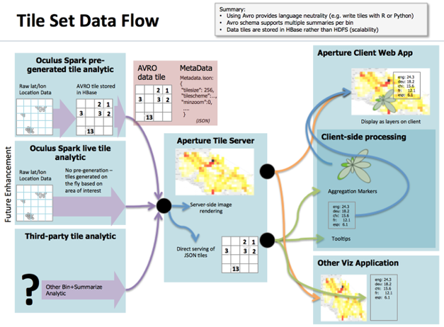

Aperture Tiles Process
=======================

Aperture Tiles uses a multi-stage process to develop tile-based visual analytics. For a detailed description of the steps required to develop custom visual analytics, see the [Quick Start Guide](../../docs/development/getting-started/quick-start/).

Aggregation Stage
-----------------

The aggregation stage projects and bins data into a predefined grid, such as the Tiling Map Service standard.  This uses a (z,x,y) coordinate system, where z identifies the zoom level, and x,y identifies a specific tile on the plot for the given zoom level. 

Tile Summarization Stage
------------------------

The summarization stage applies one or more summary statistics or other analytics to the data in each tile region, storing the result in a data store. 

Tile Rendering Stage
--------------------

The rendering stage maps the summary to a visual representation, and renders it to an image tile or html at request time. This stage is capable of rendering on-demand to support interactions such as filtering, or rich dynamic interactions such as brushing and drill-downs, if using client-side rendering with html and JavaScript.

	<h2>Interested in Learning More?</h2>

	<ul>
		<li><a href="../../docs/development/getting-started/quick-start/">Documentation</a>: Learn how to install, implement and test your Aperture Tiles applications.
		<ul>
			<li><a href="../../docs/development/getting-started/quick-start/">Quick Start</a>: Our Julia dataset provides an example of the process for generating tiles and visualizing them using Aperture Tiles.
		</ul>
		<li><a href="../../demos/">Live Examples</a>: See our demos page to see live examples of the capabilities of Aperture Tiles.
		<li><a href="../../download/">Download</a>: For details on downloading pre-packaged versions or acquiring the Aperture Tiles source code visit our download page.
	</ul>

